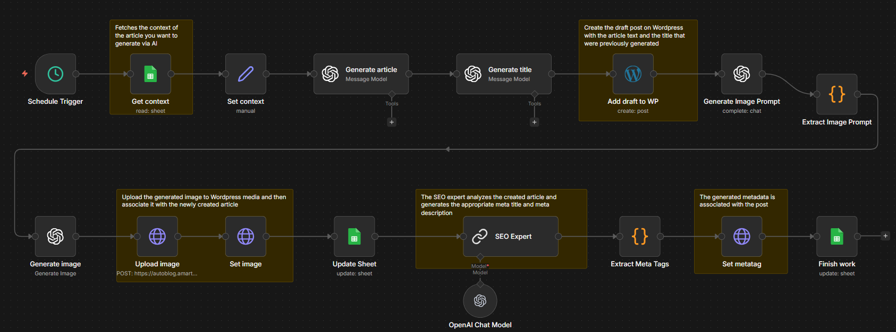

# AI Blog & SEO Automation Pipeline (n8n)

An AI-powered blog automation workflow built in n8n that generates SEO-optimized articles, titles, metadata, and images from structured prompts stored in Google Sheets, and automatically publishes them to WordPress.
Reference: https://n8n.io/workflows/3085-automate-seo-optimized-wordpress-posts-with-ai-and-google-sheets/
---

## 📌 Overview

This project builds a fully automated blog generation and publishing system.

The workflow:

- Reads blog prompts from Google Sheets  
- Generates long-form SEO-friendly articles using AI  
- Creates optimized blog titles  
- Publishes drafts to WordPress  
- Generates AI-based blog images  
- Uploads and assigns featured images  
- Creates SEO meta title & description  
- Updates all outputs back into Google Sheets  

The entire system runs automatically every few hours.

---

## 🏗️ Workflow Architecture

### 🔹 Phase 1 – Context Fetching & Trigger

- Schedule Trigger (Runs every 6 hours)  
- Google Sheets (Fetch blog prompt & context)  
- Set Node (Prepare prompt input)  

This phase ensures the system continuously picks new content ideas.

---

### 🔹 Phase 2 – AI Content Generation

- Generate Article (LLM)  
- Generate Title (LLM)  

The AI:

- Creates structured HTML blog content  
- Writes introduction, body, and conclusion  
- Ensures logical flow and SEO-friendly structure  
- Generates a concise, keyword-optimized title  

---

### 🔹 Phase 3 – Blog Publishing

- WordPress Node (Create Draft Post)  

The workflow:

- Publishes article as a draft  
- Assigns generated title and content  
- Returns Post ID and URL  

---

### 🔹 Phase 4 – Image Generation & Assignment

#### 🎨 Image Branch

- Generate Image Prompt (LLM)  
- Extract Image Prompt (Code Node)  
- Generate Image (OpenAI Image API)  
- Upload Image to WordPress  
- Set Featured Image  

The system:

- Creates realistic, blog-ready image prompts  
- Generates high-quality images  
- Uploads them to WordPress media  
- Links them as featured images  

---

### 🔹 Phase 5 – Data Storage & Tracking

- Update Google Sheet  

Stores:

- Blog URL  
- Title  
- Post ID  
- Date  

Google Sheets acts as the central tracking database.

---

### 🔹 Phase 6 – SEO Optimization

- SEO Expert (LLM Chain)  
- Extract Meta Tags (Code Node)  
- Set Meta Tags (WordPress API)  
- Final Sheet Update  

The AI:

- Generates optimized meta title (≤60 chars)  
- Generates meta description (≤160 chars)  
- Applies metadata using WordPress API (Yoast SEO compatible)  
- Updates sheet with SEO fields  

---

## 🔄 Workflow Visual

---

## 🧠 How It Works

### 1️⃣ Scheduled Execution

The workflow runs automatically every 6 hours and:

- Reads new prompts from Google Sheets  
- Identifies rows that need processing  

---

### 2️⃣ AI Blog Generation

For each prompt:

- AI generates a full-length blog article in HTML  
- Creates an SEO-optimized title  

---

### 3️⃣ WordPress Draft Creation

- Blog is published as a draft  
- Post ID and URL are captured  

---

### 4️⃣ AI Image Creation

- AI generates a realistic image prompt  
- Image is created and uploaded  
- Assigned as featured image to the blog  

---

### 5️⃣ SEO Metadata Generation

- AI analyzes blog content  
- Generates meta title and description  
- Applies them via WordPress API  

---

### 6️⃣ Data Sync

- All outputs are stored back in Google Sheets  
- Ensures traceability and content management  

---

## 🛠️ Tech Stack

- n8n (Workflow Automation)  
- OpenAI (GPT-5.1, GPT-4.1-mini)  
- Google Sheets API  
- WordPress REST API  
- OpenAI Image Generation API  
- JavaScript (Code Nodes for parsing JSON)  
- Scheduled Automation  

---

## 🔐 Required Credentials

Configure the following in n8n:

- OpenAI API Key  
- Google Sheets OAuth  
- WordPress API Credentials (REST + Basic Auth)  

---

## ✅ Features

- Fully automated blog generation  
- SEO-optimized HTML article creation  
- AI-generated titles  
- Automated WordPress publishing  
- AI image prompt + image generation  
- Featured image auto-assignment  
- Advanced SEO meta tag generation  
- Google Sheets integration for tracking  
- JSON parsing & structured data handling  
- Runs on schedule (every 6 hours)  
- Modular and scalable workflow  

---

## 🎯 Use Cases

- Content marketing automation  
- SEO blog pipelines  
- Affiliate marketing websites  
- AI-powered publishing systems  
- Niche blog automation  
- Portfolio-grade n8n + AI project  