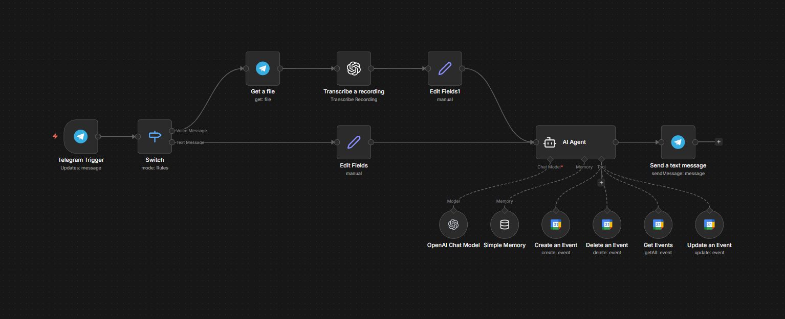

# Telegram Google Calendar Automation (n8n)

An AI-powered automation workflow built in n8n that enables users to create, update, delete, and retrieve Google Calendar events directly from Telegram using natural language.

---

## 📌 Overview

This project connects Telegram, OpenAI, and Google Calendar to build a conversational scheduling assistant.

Users can send messages like:

  - Schedule meeting at 9 am with Zahra on 8 December 2025  
  - Set a reminder tomorrow at 6pm to call mom  
  - Delete my meeting with Ravi next Monday  
  - What meetings do I have today?

The workflow processes the message, extracts structured event details using AI, performs the requested action in Google Calendar, and sends confirmation back via Telegram.

---

## 🏗️ Workflow Architecture

### Main Components

- Telegram Trigger  
- Switch Node (Text / Voice handling)  
- Get File (for voice messages)  
- OpenAI Transcription (voice to text)  
- Edit Fields (preprocessing)  
- AI Agent (intent detection + event extraction)  
- Google Calendar Nodes:
  - Create Event  
  - Delete Event  
  - Get Events  
  - Update Event  
- Telegram Send Message (confirmation)

---

## 🔄 Workflow Visual

---

## 🧠 How It Works

### 1. User Input (Telegram)
- Accepts text messages
- Accepts voice messages (automatically transcribed)

### 2. AI Processing
The AI Agent:
- Detects user intent (create, update, delete, retrieve)
- Extracts:
  - Event title
  - Date and time
  - Duration
  - Attendees
  - Recurrence (if any)
- Converts relative dates (e.g., “tomorrow 9am”, “next Monday”)

### 3. Google Calendar Integration
Depending on the intent, the workflow:
- Creates a new event
- Updates an existing event
- Deletes an event
- Retrieves scheduled events

### 4. Confirmation
A structured confirmation message is sent back to the user via Telegram.

---

## 🛠️ Tech Stack

- n8n (Workflow Automation)
- Telegram Bot API
- OpenAI (Chat Model + Audio Transcription)
- Google Calendar API
- OAuth2 Authentication

---

## 🔐 Required Credentials

To run this workflow, configure the following in n8n:

- Telegram Bot Token
- OpenAI API Key
- Google OAuth2 Credentials with Calendar scope

---

## ✅ Features

- Natural language event scheduling
- Voice message support
- Multi-turn conversational handling
- Relative date interpretation
- Full Google Calendar CRUD operations
- Real-time Telegram confirmations

---

## 🎯 Use Cases

- Personal scheduling assistant
- Conversational calendar management
- AI-based automation demo project
- Portfolio automation project

---

